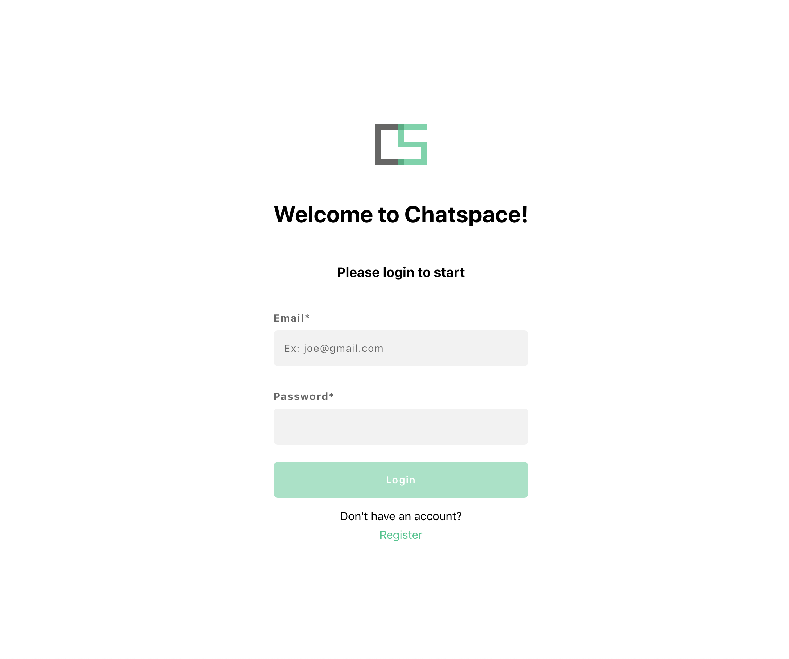
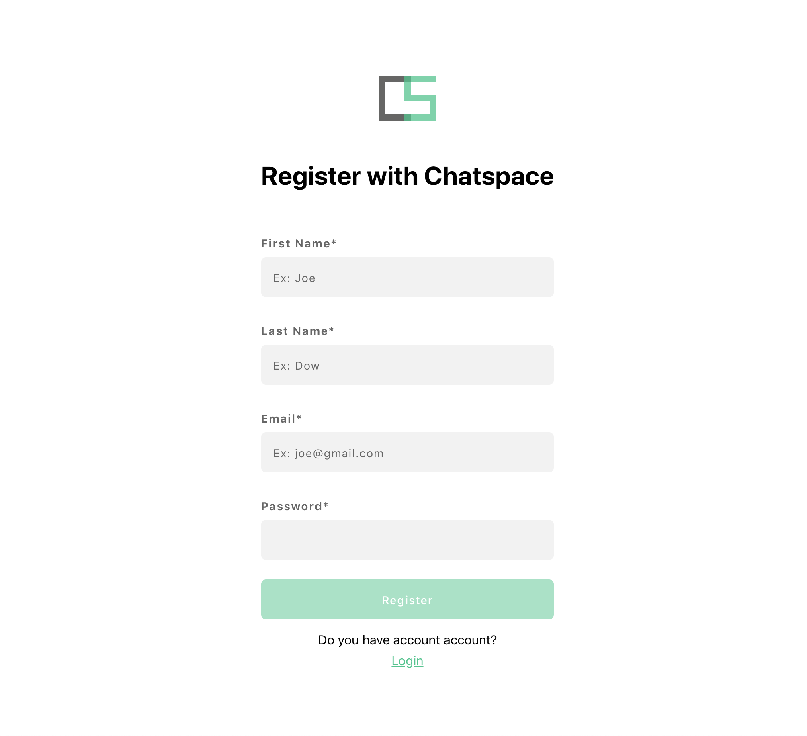
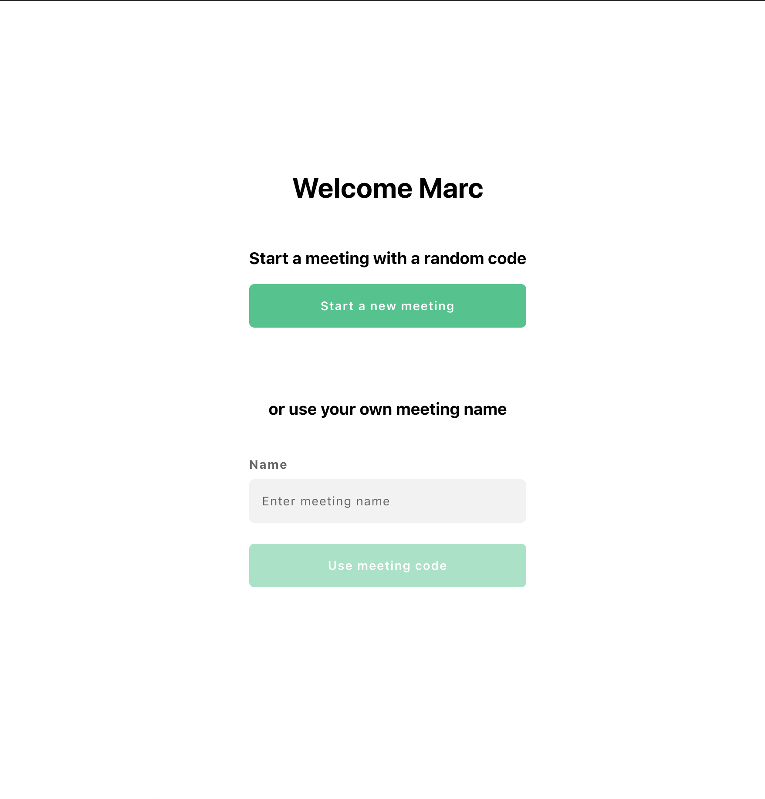
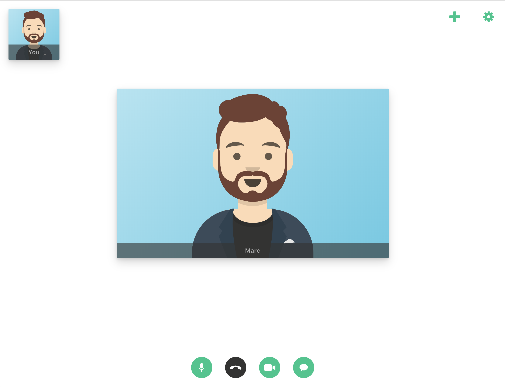
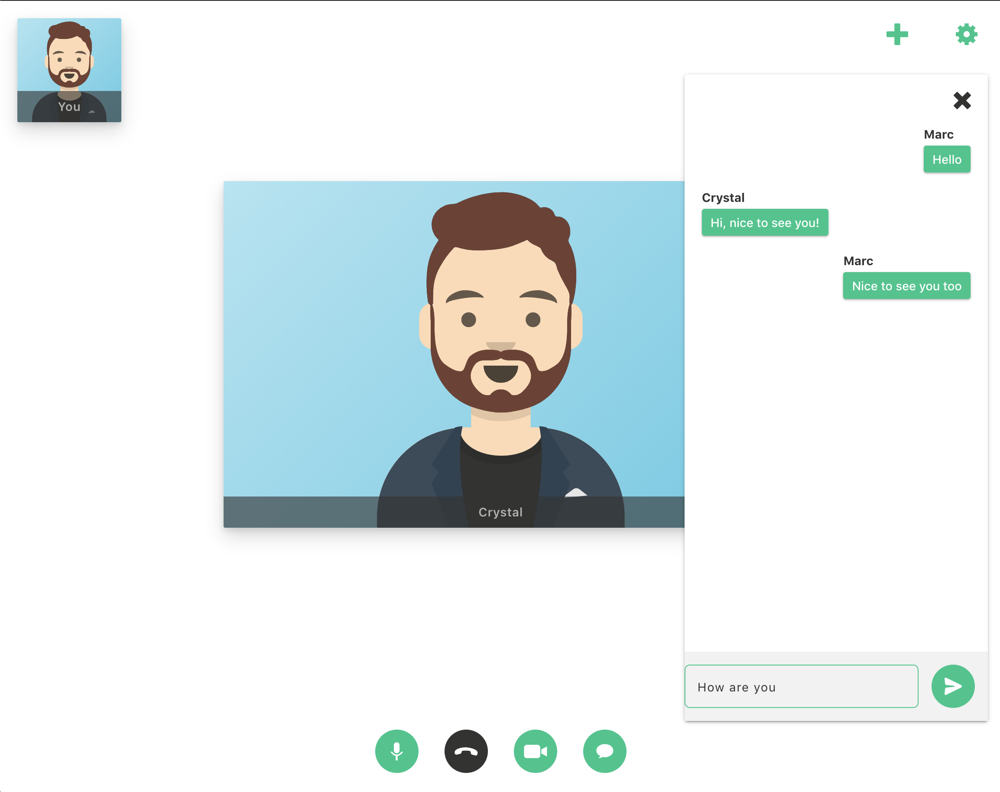
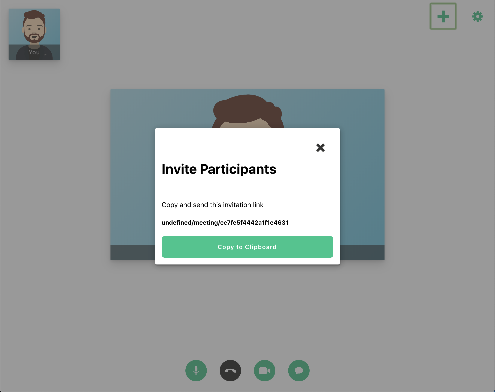
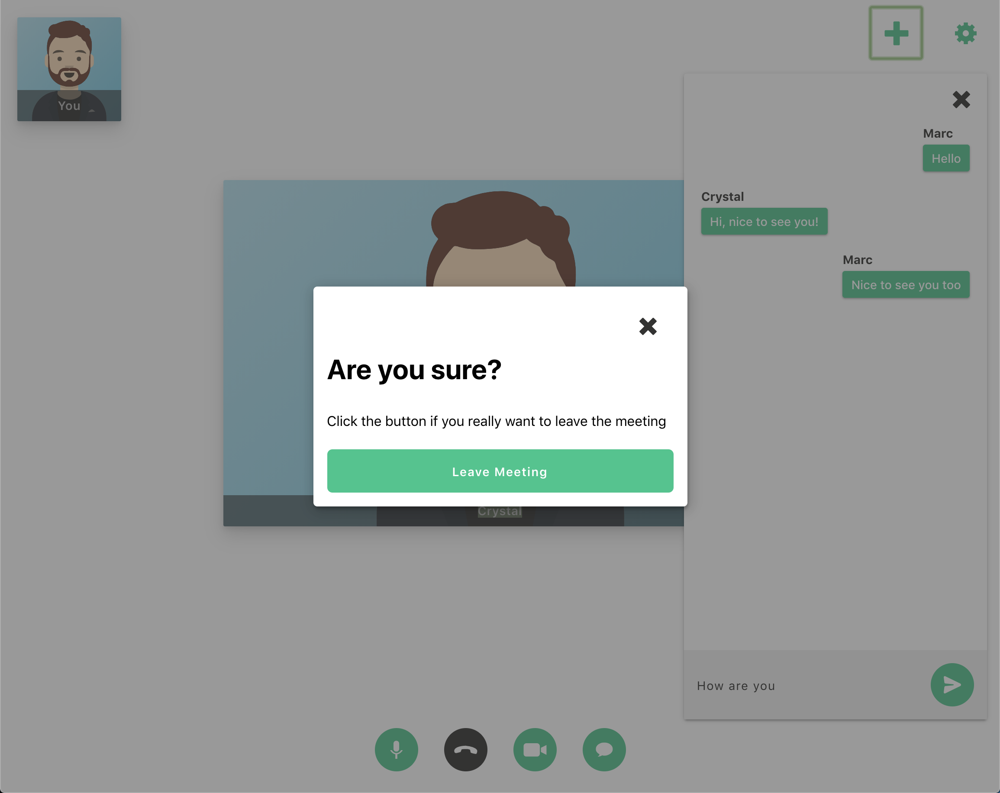

 

## Chatspace

Real-Time Video Chat App written with ReactJS and GraphQL served with a NodeJS API 

## Features

- User management
- Routing (React Router)
- Real-time Chat
- Real-time Video (WIP)

## Technologies

- Prisma
- GraphQL
- React Router
- React Apollo

## Screens

## Available Scripts

In the project directory, you can run:

### `npm start`

Runs the app in the development mode. 
Open [http://localhost:3000](http://localhost:3000) to view it in the browser.

### `npm test`

Launches the test runner in the interactive watch mode. 

### `npm run build`

Builds the app for production to the `build` folder. 
It correctly bundles React in production mode and optimizes the build for the best performance.

The build is minified and the filenames include the hashes. 
Your app is ready to be deployed!